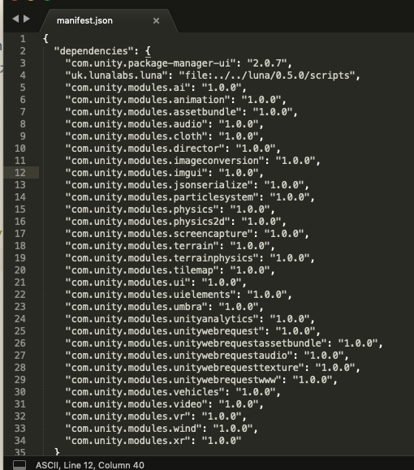
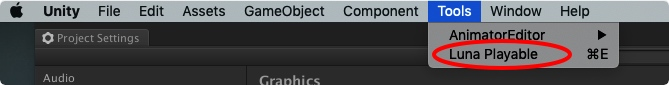
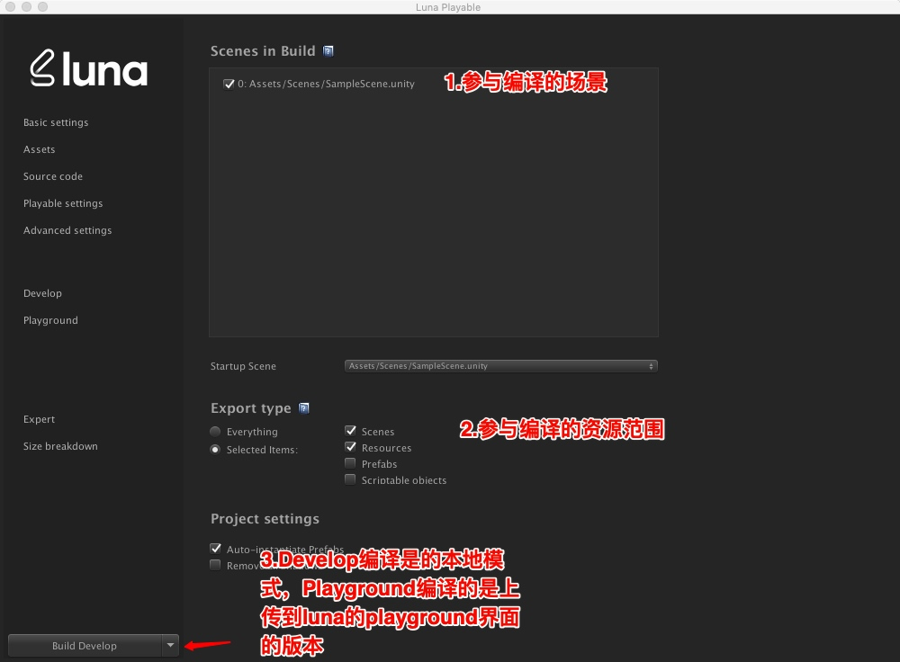
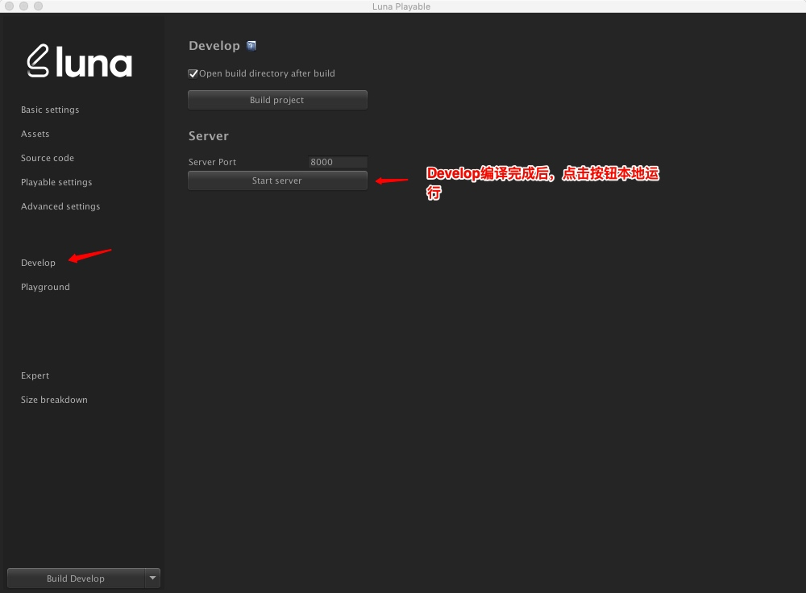
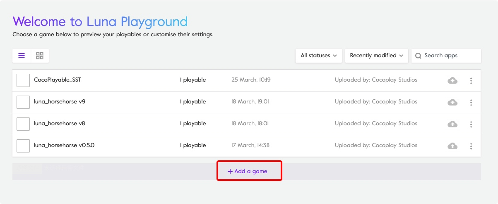
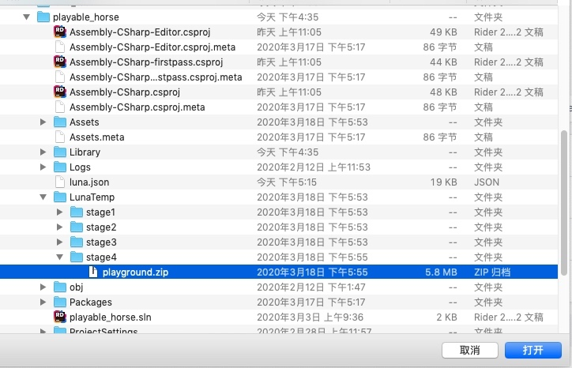
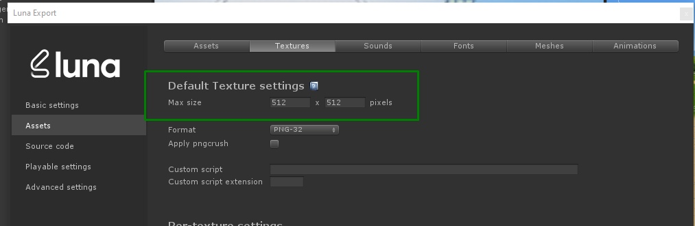
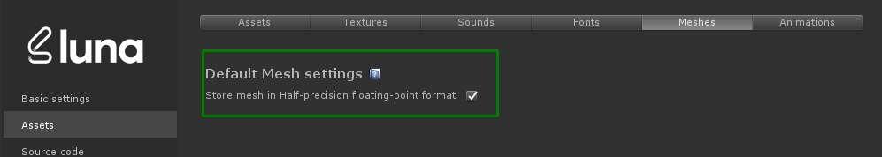
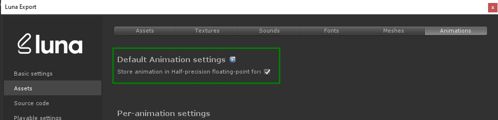
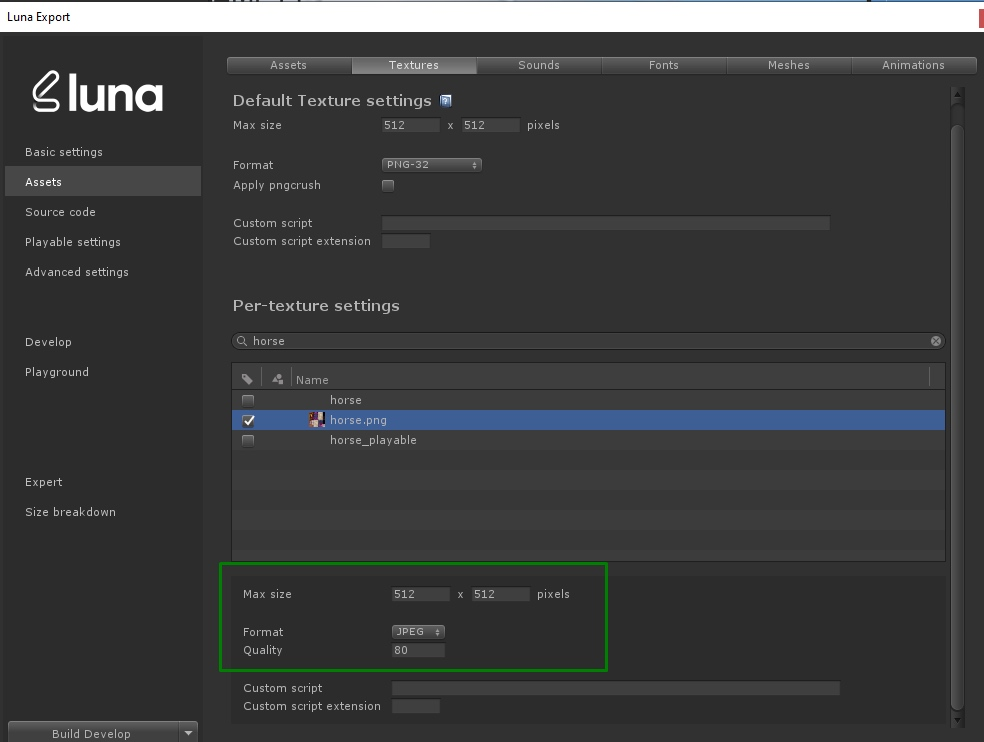

#Luna
Luna是面向开发人员的工具包，可从Unity项目创建HTML5体验。该工具套件作为Unity的插件提供，包括一个易于使用的UI以及终端命令。

###Luna的相关接口
* 安装游戏
 ```
Luna.Unity.Playable.InstallFullGame();
```

* 暂停和恢复游戏
使用Luna.Unity.LifeCycle.OnResume和Luna.Unity.LifeCycle.OnPause事件。

    ```
    Luna.Unity.LifeCycle.OnPause += PauseGameplay;
    Luna.Unity.LifeCycle.OnResume += ResumeGameplay;
    
    ...
    
    private void PauseGameplay() {
    
        // Pause the game
    }
    
    private void ResumeGameplay() {
        
        // Resume the game
    }
    ```

* 游戏结束生命周期事件

    ```
    Luna.Unity.LifeCycle.GameEnded
    ```

####Luna的使用
Unity Personal或Pro 2018.2或更高版本
.NET 4.7或更高版本

**安装方式，2种都可以**
* 通过软件包管理器安装（Unity 2018.3或更高版本）
1.将Luna发行文件解压缩到任意位置
2.通过Window > Package Manager在Unity主菜单中导航到打开Package Manager UI ：
3.在Package Manager UI中，点击窗口左下方（或右下方，取决于您的Unity版本）的“ +”按钮，然后从步骤1得到的安装包中，scripts文件夹中找到package.json

* 手动安装（Unity 2018.2或更高版本）
1.确保为项目关闭了Unity编辑器
2.将Luna发布文件解压缩到计算机上的任何文件夹
3.打开当前项目中Packages/manifest.json，添加路径，建议使用相对路径
以luna的0.5.0版本为例，添加`"uk.lunalabs.luna": "file:../../luna/0.5.0/scripts",`

项目路径，为方便后期更新Luna版本, 都可以放在/Users/john/Work/Luna/文件夹下
    * 您的项目位于 /Users/john/Work/MyUnityProject
    * 您将Luna放在项目旁边，位于 /Users/john/Work/Luna/0.5.0/
    
**编译**




playground版本，本地编译好在project/LunaTemp/stage4/playground.zip,上传到luna的[playground](https://playground.lunalabs.uk/apps)页面, _*上传过程中切勿频繁刷新，会锁死页面导致崩溃，需要luna方的协助才能解锁*_




####代码建议
* 避免逐帧调用animator的参数，修改状态，在网页版可能导致动画状态被频繁从头播放。
* 在配置animator过程中，尽量简化animator状态逻辑，使luna播放时稳定高效。
* animator的StateMachineBehaviour不支持
* yield return StartCoroutine(Func())， 不可以省略StartCoroutine。未来版本可能实现
* JsonUtility 不能使用。
* grid group 排列异常。
* 有些代码和接口在模拟器正常，但在luna编译的时候，会报错，需要寻找替代实现方法。
* Capsule Collider有一个属性Direction，不支持在代码中修改，可以直接在预设上修改
* AudioSource的PlayOnAwake不支持，需要手动调用
* AudioSource的SpatialBlend不支持代码修改
* GameObject的layer在运行中只可读，不支持在运行中修改
* GameObject.Instantiate(prefab); 如果prefab是运行场景中的，可能导致引用丢失，Luna说会在后期完善
* Image.mainTexture不支持，可改为Image.sprite.texture
* 项目的UI和相机镜头位置，在制作过程中，需要考虑横竖屏的适配
####插件相关
* FingerGestures插件编译不通过，无法使用。
* LeanTween插件编译不通过，但删除多点路径移动相关的代码后，可以运行。

####减容
* texture设置为最大512*512

* mesh设置为半浮点精度
* 动画设置为半浮点精度
* 没有透明通道的模型贴图，2D贴图可以设置为jpeg格式
* 预编译所有用到的Shadar,保存为"Assets/Luna.shadervariants“`Edit>ProjectSettings>Graphics>Save to assets`
```
Before:
    shaders                 4.29%   [|-------------------] 310.06 KB
After
	shaders                 0.52%   [|-------------------] 29.02 KB
```
* 通过脚本移除AnimationClip中无用的Scale等属性 （*1）
* 项目中尽量使用一种字体
* 带透明通道的贴图在luna中可设置导出属性为PNG 8
* 2次幂尺寸的贴图，在压缩时明显尺寸更小


